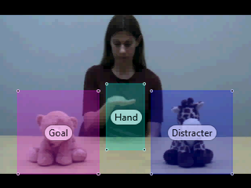
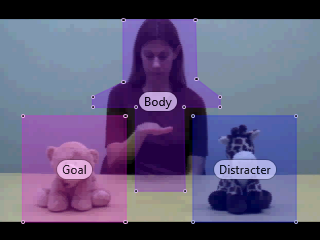

```{r Load Libraries, cache=FALSE, include=FALSE}
library(tidyverse)
library(gridExtra)
library(stats)
library(pander)
library(knitr)
```

<h2> Method </h2>

<h3> Eye-tracking Paradigm </h3>

Eighteen-month-old infants were shown an eye-tracking paradigm in which a female agent reached for one of two toys on familiarization. On test, the agent raised her hand to midline, but did not complete a reaching action. Progression to the next scene was contigent on the infant making either a location- or goal-based prediction, as previously described. If the infant did not generate sufficient fixation, the scene progressed after a total of 8 seconds had elapsed from initial presentation. The task included four different agents and toy-pairs. Test trials were shown twice, each after a familiarization scene, for a total of 8 Test Trials. Two datasets of gaze-fixations were generated to investigate potential differences in the prescribed definition of a predicition from either the Hand AOI or Body AOI, as pictured below.







<h3> [Data Reduction](Tidying.html) </h3>


Load in data.
```{r Load Data, echo=TRUE, message=FALSE, warning=FALSE}
MOAP <- read_csv("data/MOAP.csv")
# Fix pesky `` issue
names(MOAP)[1] <- "Test"
# Drop NA rows
MOAP <- drop_na(MOAP, Hand_Prediction, Body_Prediction)
```

<h3> Exclusions </h3>

A total of 12 infants were excluded from analysis due to low calibration (n = 4), fussiness (n = 2), and sample rate < 50% (n = 6).

```{r Exclusions, echo=TRUE, message=FALSE, warning=FALSE}
filtered <- MOAP %>%
  filter(ID != "M08" & ID != "M11" & ID != "M14" & ID != "M17" & ID != "M18" & ID != "M25" & ID != "M26" & ID != "M27" & ID != "M30" & ID != "M31"  & ID != "M32"  & ID != "M33")

ValidTrials <- filtered %>%
  summarise(n = n())

kable(ValidTrials,
      col.names = c("Total"),
      caption = "Number of Valid Trials")
```

<h2> Analysis </h2>
<h3> Summary </h3>
<h4> Hand AOI </h4>

```{r Hand AOI Summary}
HandSummary <- filtered %>%
  group_by(Hand_Prediction)%>%
  summarise(n = n())

kable(HandSummary,
      col.names = c("Prediction Type", "Num Predictions"),
      caption = "Number of Predictions from Hand AOI")
```

<h4> Body AOI </h4>

```{r Body AOI Summary}
BodySummary <- filtered %>%
  group_by(Body_Prediction)%>%
  summarise(n = n())

kable(BodySummary,
      col.names = c("Prediction Type", "Num Predictions"),
      caption = "Number of Predictions from Body AOI")
```

<h3> Question #1 </h3>

Does varying initial fixation AOI from hand to body change prediction response?

```{r Prediction Proportions, echo=TRUE, message=FALSE, warning=FALSE}
# Graph Proportion of Predictions for each initial AOI
HandProp <- HandSummary %>%
  mutate(AOI = "Hand")%>%
  rename(Prediction = Hand_Prediction)
BodyProp <- BodySummary %>%
  mutate(AOI = "Body")%>%
  rename(Prediction = Body_Prediction)
AOIProp <- rbind(HandProp, BodyProp)%>%
  group_by(AOI)%>%
    mutate(prop = prop.table(n))

ggplot(AOIProp,
       aes(x=Prediction, y=prop, fill=AOI)) +
  facet_grid(. ~ AOI) +
  geom_bar(stat = 'identity', position = 'dodge')+
  labs(title = "Predictions by AOI", x = "Prediction", y = "Proportion of Predictive Fixations")
```

The graphs indicate that more predictions are revealed by an anlysis of fixations originating from the body than the hand. 

<h4> Compare AOIs </h4>

```{r Compare AOI, echo=TRUE, message=FALSE, warning=FALSE}
# Recode Predictions
HP <- filtered %>%
  filter(Hand_Prediction != "No Prediction")%>%
  select(ID, Trial_Num, Hand_Prediction, Hand_Latency, FamTrialLength_ms, Fam_Screen)%>%
  na.omit()%>%
  mutate(Prediction = ifelse(Hand_Prediction == "Distracter", 0, 1))%>%
  select(Prediction)
BP <- filtered %>%
  filter(Body_Prediction != "No Prediction")%>%
  select(ID, Trial_Num, Body_Prediction, Body_Latency, FamTrialLength_ms, Fam_Screen)%>%
  na.omit()%>%
  mutate(Prediction = ifelse(Body_Prediction == "Distracter", 0, 1))%>%
  select(Prediction)

tests <- list()
tests[[1]] <- t.test(HP$Prediction, mu=.5)
tests[[2]] <- t.test(BP$Prediction, mu=.5)

df <- sapply(tests, function(x) {
      c(x$statistic,
        x$parameter,
        Mean = x$estimate[1],
       ci.lower = x$conf.int[1],
       ci.upper = x$conf.int[2],
       p.value = x$p.value)
    })
colnames(df)<- c("Hand", "Body")
kable(t(df))
```

Planned comparisons against chance (.5) revealed that when using the Body definition, infants launched predictive fixations systematically to the prior goal &#40;M=0.60, SD=.49, t&#40;88&#41;=2.04, p = .04*&#41;, whereas, when using the Hand definition, infants responded at chance levels &#40;M=0.48, SD=.50, t&#40;49&#41;=-0.28, p = .78&#41;. Therefore, remaining analyses will be performed on data generated from an initial fixation to the Body AOI.

<h3> Question #2 </h3>
Does latency vary between type of prediction?

```{r Latency}
PredLat <- filtered %>%
  filter(Body_Prediction != "No Prediction")%>%
  select(ID, Trial_Num, Body_Prediction, Body_Latency, FamTrialLength_ms, Fam_Screen)%>%
  na.omit()%>%
  mutate(Prediction = ifelse(Body_Prediction == "Distracter", 0, 1))%>%
  group_by(Prediction)

tests <- list()
tests[[1]] <- t.test(Body_Latency ~ Prediction, data = PredLat)

df <- sapply(tests, function(x) {
      c(x$statistic,
        x$parameter,
        x$estimate[1],
        x$estimate[2],
       ci.lower = x$conf.int[1],
       ci.upper = x$conf.int[2],
       p.value = x$p.value)
    })
kable(t(df))
```

Planned comparisons against chance (.5) revealed that infants did not differ reliably in the time required to generate prior goal predictions (M=1628, SD=1591) compared to prior location predictions (M=2051, SD=2011; t(60)=1.04, p =.29). However, the standard deviations appear relatively high. Mediating factors will be explored next.

<h3> Question #3 </h3>
Can attention to the scene during the Familiarization trial predict whether or not an infant will generate a prediction?  

```{r Attention Prediction}
# Calculate % attention
Attention <- PredLat %>%
  mutate(Attention = Fam_Screen / FamTrialLength_ms)

```

    * Stat - Linear regression for fam attention to predict infants generation of prediction  
    * Binomial - Yes/No  

<h3> Question #4 </h3>
Can attention to Fam predict what type of prediction infants will generate when they do make a prediction?  
    * Stat - Linear regression for fam attention to predict infants type of prediction  
    * Binomial - Goal/Location  

```{r Attention Latency}

```


